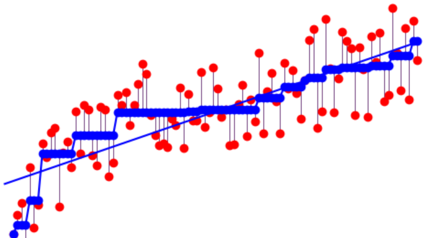

# Calibration

## Overview of Calibration Methods

### Histogram Binning ([paper](http://cseweb.ucsd.edu/~elkan/calibrated.pdf))

Input: softmaxed logits

1. Put dev scores in bins.
2. Calculate average dev label $\hat{p}_i \in [0,1]$ for bin $i$.
3. Put test scores in bins with same boundaries as dev scores.
4. Assign $\hat{p}_i$ as calibrated score for each uncalibrated test score in bin $i$.

### Isotonic Regression ([paper](https://www.jstor.org/stable/2284712?seq=1#metadata_info_tab_contents))

Input: softmaxed logits

Isotonic = order preserving / monotonically increasing

Learn a monotonically increasing piecewise function that pulls uncalibrated scores toward $y = x$ on a reliability diagram.

See https://scikit-learn.org/stable/modules/isotonic.html for more.

### Temperature Scaling ([paper](https://arxiv.org/pdf/1706.04599.pdf))

Input: pre-softmaxed logits

Using the validation set, learn (by minimizing negative log likelihood) a single scalar parameter T to multiply logits by.

Multiply logits by the learned T parameter and then softmax to get calibrated confidence scores.

---